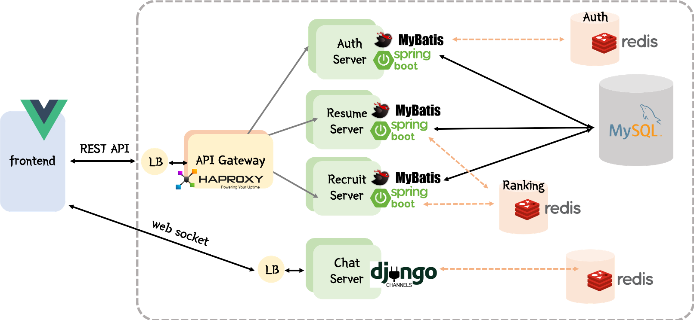
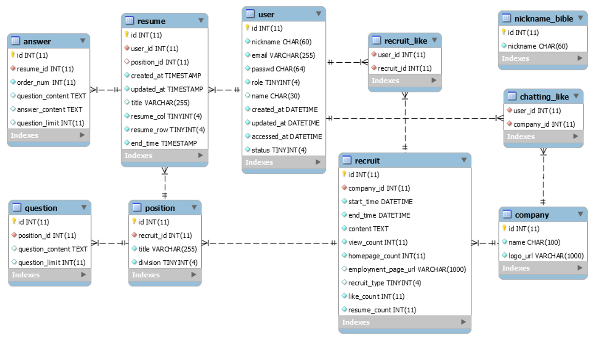

# 합격하소서 👩🏻‍💻 👨🏻‍💻

> 스마일게이트 서버 개발 캠프 4기, 자소설 닷컴 클론 코딩 프로젝트

[](https://youtu.be/2VK6UbJtVYc?t=0s)

<br />


## I. 프로젝트 기능

> **자소설닷컴을 클론코딩한 이유**
>
> - 기획과 디자인에 들어가는 시간을 최소화하고 개발에 더 집중하기 위해 `클론 코딩`을 하기로 결정
>
> - 페이스북, 인스타와 같은 소셜 서비스의 경우, 이미 많은 참고자료들이 존재하기에 스스로 고민해보지 않을 것 같아 제외
>
> - 팀원들이 서버개발캠프에서 해보고 싶었던 기능이나 기술(채팅, 트래픽, 캐시 등)을 사용할 수 있는 사이트 중 최근 셋 모두 사용한 경험이 있는 `자소설닷컴`을 주제로 선정

- 타겟 서비스에서 일어날 만한 문제를 예상해보고, 어떻게 해결할 수 있을지 스스로 고민해보는 것을 목표로 주요 기능 선정
- 사용자가 증가했을 때 문제가 생길만한 기능 위주로 테스트 진행

### 주요 기능

1. 채용공고 상세 조회
   - DB 상에서 많은 조인이 일어나므로 캐시를 활용하여 API 속도 개선
2. 자소서 저장 
   - 분당 약 1000건의 요청이 몰리는 것을 처리하는 것을 목표로 함
3. 실시간 채팅  
   - reverse proxy를 활용하여 1000명 이상의 사용자가 채팅할 수 있는 서버 구현

  ### 기본 기능

- 드래그 앤 드롭 UI
- 소셜 로그인
- 실시간 랭킹
- 자기소개서 CRUD

<br />

## II. 팀원 및 역할

### 🦄 김나영 [github](https://github.com/naye0ng)

- vue.js를 이용한 `프론트엔드` 


- Django channels 기반의 `채팅 서버` 
- 데이터 크롤링을 통한 `DB 구축`


### 🐿 명다연 [github](https://github.com/meme2367)

- Spring boot 기반의 `채용 공고 서버`
- redis를 이용한 `실시간 랭킹`
- HAproxy를 이용한` API Gateway` 


### 🐵 채윤병 [github](https://github.com/yunb2)

- Spring security 기반의 `인증 서버`
- Spring boot를 이용한 `자기소개서 서버`
- OAuth를 활용한 `소셜 로그인` 

<br />

## III. 구성

### 🔧 아키텍처

- `SPA` , `MSA` 구조로 프로젝트를 구성




### 💡 ERD




### 📂 파일 구조

```
.
├── README.md
├── backend 
│   ├── AUTH_SERVER    // 인증 서버
│   ├── CHAT_SERVER    // 채팅 서버
│   ├── RECRUIT_SERVER    // 채용 공고 서버
│   ├── RESUME_SERVER    // 자기소개서 서버
│   └── data    // sql문
├── frontend     // 프론트엔드
└── data    // 크롤링 스크립트
```

